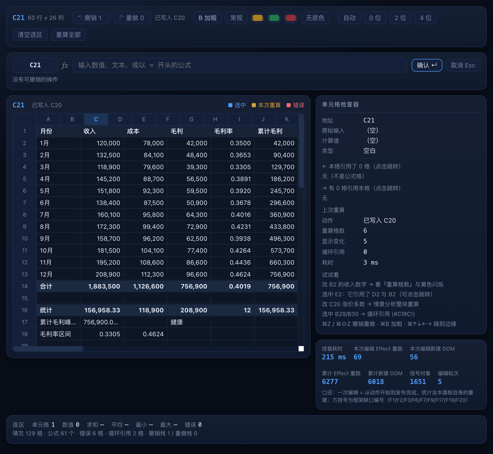

# Citrine Sheets（迷你电子表格）

用 [Citrine](https://github.com/ShiningRay/citrine)（信号式 Ruby UI 框架，经 Opal 编译到浏览器）
写的**键盘优先**迷你电子表格：公式引擎、依赖图增量重算、循环引用检测、撤销重做、
选区聚合统计、每格独立格式。

> 这是本项目的**第二个方向不同的 demo**：第一个
> [citrine-market-terminal](https://github.com/ShiningRay/citrine-market-terminal) 是
> 鼠标驱动 + 模拟数据流 + 数值展示；本仓库反过来——**键盘驱动 + 用户输入 + 递归依赖图**，
> 架构上也刻意相反（那边单类 + 混入，这边**多根挂载 + 共享模型**）。
>
> 开发中撞出的框架摩擦记在 **[FRICTION-2.md](FRICTION-2.md)**（15 条 + 一节 Opal 专题，含源码定位与改法建议）。

```
┌─ 工具条：选区/维度 · 撤销重做 · 加粗与底色 · 小数位 · 清空 · 重算 ───────────────┐
├─ 公式栏：[地址] fx [ 编辑框（直接打字即进入编辑） ] 确认/取消 ───────────────────┤
├──────────────────────────── 网格 26 列 × 60 行 ──────────┬─ 单元格检查器 ──────┤
│   A      B        C        D        E         F          │  原始输入/计算值/类型 │
│ 1 月份   收入     成本     毛利     毛利率    累计毛利    │  ← 引用了哪些格（可点）│
│ 2 1月    120,000  78,000   42,000   0.3500    42,000     │  → 被哪些格引用（可点）│
│ …                                                        │  上次重算：格数/耗时  │
│ 14 合计  1,883,500 …                                     ├─ 信号与渲染埋点 ─────┤
│ 16 统计  AVERAGE/MIN/MAX/COUNT                           │  挂载耗时 / Effect 数 │
│ 20 情景分析（改 C20 涨价系数 → 整块重算）                │  新建 DOM / 信号对象  │
│ 27 错误演示（#DIV/0! #CIRC! #REF! #VALUE! #NAME?）        │  编辑轮次            │
└──────────────────────────────────────────────────────────┴──────────────────────┘
├─ 状态栏：选区 求和/平均/最小/最大/错误 · 全表 填充/公式/错误/循环 · 撤销栈 ───────┤
```

示例数据是一份 12 个月的损益表（收入/成本/毛利/毛利率/累计毛利 + 合计 + 统计 + 情景分析
+ 五种错误演示），载入即可玩。



## 运行

```bash
# 依赖：Ruby ≥ 3.0、Opal 1.8（gem install opal）、Node（仅验收用）
# 需要 citrine 仓库与本仓库同级，或用 CITRINE_ROOT 指定

bin/dev                 # → http://localhost:4404/sheets.html
                        #    改 app/**/*.rb 或 citrine/lib/**/*.rb 都会自动刷新

rake check              # 单测 + 桩验收 + 跨平台一致性（提交前跑）
```

| 命令 | 作用 |
|---|---|
| `bin/dev` | 开发服务器（包装 citrine 的 dev server，端口 4404，支持 `-p` 覆盖） |
| `rake test` | CRuby 内核单测（48 项 / 203 断言：解析、求值、函数、依赖图、撤销） |
| `rake build` | 编译 `app/sheets.rb` → `app/sheets.js` |
| `rake stubs` | Node DOM 桩验收（77 项键盘与编辑链路断言，不需要浏览器） |
| `rake parity` | CRuby 与 Opal 两侧内核输出**逐字节**比对（95 行） |
| `rake check` | 以上全部 |

## 操作

| 操作 | 方式 |
|---|---|
| 移动 | 方向键 · 点选 · `⌘↑↓←→` 跳到数据边缘 |
| 扩展选区 | `Shift+方向键`（状态栏实时显示求和/平均/最值） |
| 编辑 | **直接打字即编辑** · `Enter` 编辑现有内容 · `Backspace` 清空后编辑 |
| 提交 / 取消 | `Enter` 提交并下移 · `Tab` 提交并右移 · `Esc` 取消 |
| 撤销 / 重做 | `⌘Z` / `⌘⇧Z`（含公式与依赖图的完整回滚） |
| 加粗 | `⌘B`（选中区域批量应用） |
| 清空 | `Delete` 清空选区内容与格式 |
| 格式 | 工具条：加粗、底色、小数位（自动/0/2/4 位） |

**试试看**：改 `B2` 的收入数字 → 看右侧「重算格数」与网格里的黄色闪烁（受影响的格子会被标注）；
选中 `E2` 看它引用了 `D2`/`B2`（点标签直接跳转）；改 `C20` 涨价系数 → 情景分析整块重算；
选中 `B29` 看循环引用 `#CIRC!`，改成常量即可打破、`⌘Z` 可撤销回来。

## 目录

```
├── app/
│   ├── sheets.rb            # 浏览器入口：挂载六个根 + 启动键盘外挂层
│   ├── sheets.html          # 页面外壳（设计令牌 / 网格与面板样式）
│   ├── application.rb       # ★ 共享模型：选区、编辑缓冲、格式、撤销、视图信号
│   ├── workbook.rb          # ★ 工作簿：单元格、依赖图、拓扑重算、循环检测、信号发布
│   ├── formula.rb           # 公式语言：词法 + 递归下降解析 + 静态依赖提取
│   ├── evaluator.rb         # 求值器（IF/AND/OR/IFERROR 短路求值，错误值传播）
│   ├── functions.rb         # 函数库（SUM/AVERAGE/MIN/MAX/COUNT/ROUND/IF…共 18 个）
│   ├── value.rb             # 值语义：错误值、强制转换、比较
│   ├── format.rb            # 显示格式化（千分位、小数位、列标签 A..Z）
│   ├── num.rb               # 跨平台数值工具（Opal 整数除法/取整差异 → FRICTION-2 G-11）
│   ├── seed.rb              # 示例数据（损益表 + 统计 + 情景分析 + 错误演示）
│   ├── telemetry.rb         # 埋点：Effect 重跑 / 新建 DOM 计数（v1 无官方钩子 → G-10）
│   ├── glue.rb              # 外挂层：全局键盘、定时器、原生焦点、桩 API（→ G-9/G-10）
│   ├── parity.rb            # 跨平台一致性输出脚本（由 rake parity 驱动）
│   └── panels/              # 六个挂载根（各自独立订阅，互不牵连）
│       ├── common.rb        #   基类 + 视图层纪律（改视图前先读）
│       ├── toolbar.rb       #   撤销重做 / 格式 / 清空 / 重算
│       ├── formula_bar.rb   #   地址 + 编辑框（★ 永不重建，焦点所在的节点）
│       ├── grid.rb          #   列头 + 行头 + 1560 个单元格（三层结构）
│       ├── inspector.rb     #   单元格详情 + 依赖跳转 + 重算报告
│       ├── status_bar.rb    #   选区聚合统计 + 全表统计
│       └── debug_bar.rb     #   信号与渲染埋点
├── test/
│   ├── workbook_test.rb     # CRuby 内核单测（含解析/求值/依赖图/循环/撤销）
│   ├── sheets_stub_check.js # Node DOM 桩验收（键盘优先的全链路）
│   └── harness.js           # 桩宿主（模拟 DOM + window 键盘 + 定时器 + 事件冒泡）
├── FRICTION-2.md            # ★ 本仓库撞出的改进清单（15 条 + §7「要不要 fork Opal」调研）
└── docs/                    # 第一辑的框架审计报告与探针（背景参考）
```

## 三层验证

| 层 | 手段 | 覆盖 |
|---|---|---|
| 内核 | `rake test`（CRuby + minitest，48 项） | 解析优先级/结合性/引用/区间/错误、求值与错误传播、18 个函数、依赖图与增量重算范围、循环检测与恢复、撤销重做、格式与显示 |
| 装配 | `rake stubs`（Node DOM 桩，77 项） | 多根挂载、点选与键盘导航、选区扩展与聚合、直接打字即编辑、提交与依赖链联动、格式、清空、撤销重做、循环引用、依赖跳转、闪烁、渲染开销量化 |
| 一致性 | `rake parity` | 同一份内核在 CRuby 与 Opal 下输出逐字节一致（95 行）——表格引擎到处是除法与取整，这是跨平台语义差异的重灾区 |

浏览器侧实测（Chrome，`bin/dev` 起服务）：六个面板与 1560 格正常渲染
（`.grid-scroll` 563×460、内容 1380px 可滚动）、控制台零报错；
方向键/Shift 扩展/直接打字编辑/Esc 取消/⌘Z 全部生效；
改 `B2` 触发 **33 格重算、26 格显示变化**，改 `C20` 让情景分析整块联动。

**渲染开销量化**（真机埋点，面板底部实时显示）：

| 场景 | 新建 DOM 节点 | 来源 | 说明 |
|---|---|---|---|
| 挂载 1560 格（约 4700 节点） | — （**215 ms**） | 真机 | 每格三层结构（布局 / 外观 / 文本） |
| 改 `B2`（33 格重算、26 格闪烁） | **210** | Node 桩 | 其中 54 是闪烁标注（每格 2 个），其余是检查器/状态栏/埋点各自的内容块 |
| 改 `C20`（6 格重算、5 格闪烁） | **56** | 真机 | 同上，规模小 |
| 移动一格选区 | **58** | Node 桩 | 两个单元格换外观 + 检查器/状态栏刷新 |
| 单元格数值更新本身 | **0** | 两侧一致 | 叶子块只调 `textContent`，不新建节点 |

> 对照：把单元格直接建在行块里（让行块订阅整行信号）时，同一次编辑要新建 **1903** 个节点
> ——差别只在于 props 写在哪一层求值，见 FRICTION-2 的 G-2。

## 已知取舍

- 不支持合并单元格、行列宽高调整、拖拽填充、多工作表
- 公式语言是子集：无数组公式、无跨表引用、无 `%` 后缀运算符、无文本比较的大小写折叠
- 循环引用会把**环内及环下游**的格子都标为 `#CIRC!`（不做 SCC 精确区分环内外）
- 撤销以"整表快照"实现（数据量级下足够快，不是增量日志）

## 许可

MIT（与 citrine 一致）
